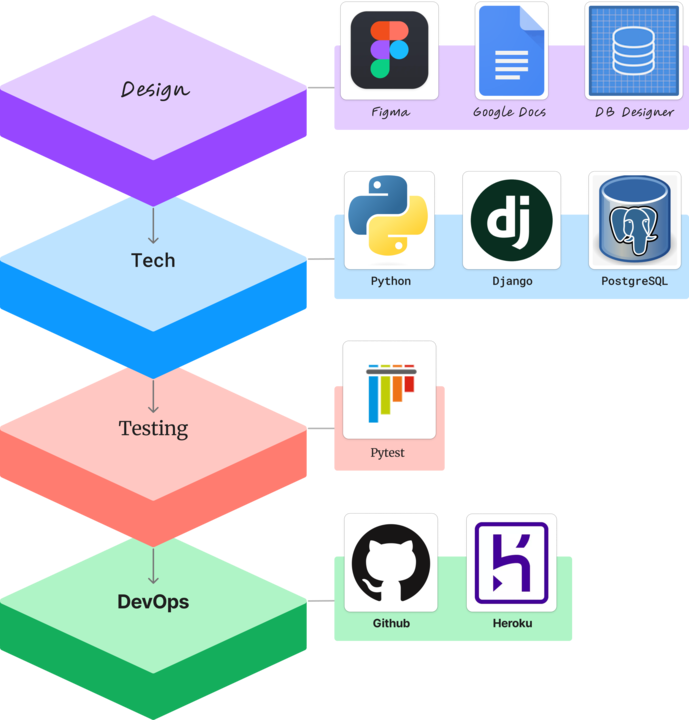

# README

<div align="center">

  [![Contributors][contributors-shield]][contributors-url]
  [![Forks][forks-shield]][forks-url]
  [![Issues][issues-shield]][issues-url]

  <a href="https://github.com/Apres-Ski">
    
  </a>
  <h2 align="center">Après-Ski</h2>

  <h3 align="center">
    <a href="https://github.com/Apres-Ski/Apres_Ski_BE/issues">Report Bug</a>
    ·
    <a href="https://github.com/Apres-Ski/Apres_Ski_BE/issues">Request Feature</a>
  </h3>
</div>
<br>

Hungry and tired after a day at Breckenridge? Looking to find somewhere that's: fun, good vibes, close enough to walk?

**Find it with Après-Ski!**

The web application geared towards snowsport entheusiests looking to find their post slopes *food & drinks* to round out a good day.
<br>

---

<details>
  <summary>Table of Contents</summary>

  :skier: [Getting Started](#getting-started)
  <br>
  :skier: [API Endpoints](#api-endpoints)
  <br>
  :skier: [Project Overview](#project-overview)
  <br>
  :skier: [Contributors](#contributors)
  <br>
  :skier: [Contributing](#contributing)
  <br>
  :skier: [Acknowledgments](#acknowledgments)
  <br>

</details>

 <br>

<!-- GETTING STARTED -->

## Getting Started

### Web Usage [Work In Progress]

This is a Django REST Framework API designed for a React web application. To get started, follow the link below and select one of our test-users. Once you selected a user you will be able to:

* Search for restaurants by proximity to the user.
* [get with FE to finish feature list]

<br>

### Local Installation

This back-end application was made with the following:

* Python 3.11.1
* Django 4.1.6

To install and run on your personal computer you will need to do the following:

1. Get a free API Key for Geoapify's Routing-API at [Geoapify](https://www.geoapify.com/).
2. Fork and clone the repo to your local machine.
3. In the root directory of APRES_SKI_BE, create a file named `keys.py`.
4. Inside `keys.py` create a variable named `routing_key = 'your_key_as_string'`
    * Note: `keys.py` should be *grayed out*. If it is not, check the `.gitignore` and resolve the issue before pushing any changes.
5. Install requirements.
    ```zsh
    pip3 install -r requirements.txt
    ```
6. Start a server.
    ```zsh
    python3 manage.py runserver
    ```
7. Navigate to <http://localhost:8000/api/v1/>

<br />

<!-- API ENDPOINTS -->

## API Endpoints
### GET

<details>
<summary> <code>localhost:8000/api/v1/restaurants</code> </summary>

>**Description**
> - Get a list of restaurants.
>
>**Parameters**
>
> - N/A
>
>**Response**
>
>#### 200 OK
>
> ```json
>{
> "data": [
>  {
>   "type": "str",
>   "id": "int",
>   "attributes": {
>    "name": "str",
>    "address": "str",
>    "food_type": "str",
>    "cost": "str",
>    "cover_img": "str",
>    "alt_text": "str",
>    "lat": "str",
>    "lon": "str",
>    "alcoholic_drinks": "bool",
>    "has_happy_hour": "bool",
>    "hour": [
>     {
>      "id": "int",
>      "sunday": "str",
>      "monday": "str",
>      "tuesday": "str",
>      "wednesday": "str",
>      "thursday": "str",
>      "friday": "str",
>      "saturday": "str",
>      "restaurant": "int (id)"
>     }
>    ],
>    "happyhour": [
>     {
>      "id": "int",
>      "sunday": "str",
>      "monday": "str",
>      "tuesday": "str",
>      "wednesday": "str",
>      "thursday": "str",
>      "friday": "str",
>      "saturday": "str",
>      "special": "str",
>      "restaurant": "int (id)"
>     }
>    ],
>    "engagement": [
>     {
>      "id": "int",
>      "vibe": "str",
>      "rating": "str",
>      "favorites": "bool",
>      "restaurant": [
>       "int"
>      ],
>      "user": [
>       "int"
>      ]
>     },
>     {"..."}
>    ]
>   }
>  },
>  {"..."}
> ]
>}
>```
>
>#### 404 Not Found
>
>```json
>{
> "errors": [
>  {
>   "detail": "Not found.",
>   "status": "404",
>   "code": "not_found"
>  }
> ]
>}
>```
>
>**Notes**
>
> * `hour`, `happyhour`, and `engagement` will return empty arrays if there is no associated table for the given restaurant.

</details>

<br>

<!-- PROJECT OVERVIEW -->

## Project Overview

### Learning Goals
Backend team learning goals were:
- Gain exposure and experience to Python and Django Framework.
- Implement Agile work process throughout development.
- Use Service Oriented Architecture concepts.
- Practice professional git workflow and pull request reviews. 
- Implement Continuous integrations.
- Further hone communicational skills to Frontend stack team by doing daily standups and slack networking. 
<br>

### Planning

<br>

### Tech Stack

Après-Ski's Back-end is a ***Django REST Framework*** API, built with **Python**, and hosted on Heroku.

<br>
<div align='center'>
  
</div>

<br>

### MVP and Extensions Roadmap

##### MVP
Backend MVP goals were to create and deliver endpoints for our Frontend team to consume and display. For our Minimum Viable Product we created a Postgresql database with the follwing tables:
- Users
- Restaurants
- Engagements
- (Ski) Lifts
- (Restaurant) Hours
- (Restaurant) Happy Hours

Each table stored real data on various restaurants and lifts in Breckinridge Colorado. Information was gathered through various travel and restaurant websites.  

##### Extensions/ future features

Future features we wish to implement for this application would be: 
- Allowing users to see how close restaurants are to each ski lift.
- Show landmarks and information on the landmarks on the map
- Photo Galleries for each restaurant
- Allowing users to have further engagement by being able to 
  - rate each restaurant.
  - leave comments about the restaurant.

<br>

<!-- COLLABORATORS -->

## Collaborators

<div align='center'>
<table>
<tr>
<th>Joseph Hilby</th>
<th>Kristen Nestler</th>
<th>Kevin Ta</th>
</tr>
<tr>
<td></td>
<td></td>
<td></td>
</tr>

<tr>
<td>
<a href="https://github.com/josephhilby" rel="nofollow noreferrer">
 Github
</a><br>
<a href="https://www.linkedin.com/in/josephmhilby" rel="nofollow noreferrer">
 LinkedIn
</a>
</td>
<td>
<a href="https://github.com/knestler" rel="nofollow noreferrer">
 Github
</a><br>
<a href="https://www.linkedin.com/in/kristen-nestler/" rel="nofollow noreferrer">
 LinkedIn
</a>
</td>
<td>
<a href="https://www.linkedin.com/in/kevin-ta-b1a36723b/" rel="nofollow noreferrer">
 Github
</a><br>
<a href="https://github.com/KevinT001" rel="nofollow noreferrer">
 LinkedIn
</a>
</td>
</tr>
</table>
</div>

<!-- CONTRIBUTING -->

## Contributing

Do you have a better & cooler way of doing what I did? Your contribution would be **greatly appreciated**.

Please fork the repo, create your branch, and create a pull request. You can also simply open an issue with the tag "enhancement".

1. Fork the Project
2. Create your Feature Branch (`git checkout -b feature/AmazingFeature`)
3. Commit your Changes (`git commit -m 'Add some AmazingFeature'`)
4. Push to the Branch (`git push origin feature/AmazingFeature`)
5. Open a Pull Request

Thanks again!

<!-- ACKNOWLEDGMENTS -->

## Acknowledgments

Special *thank you!*, for your insight and help, as we designed and built an API in a totally new language and framework:

* [Mike Hernandez](https://github.com/mikez321)
* [Jake Cohen]()

Thank you [Tricia Holmes](https://github.com/tricia-holmes) on our Front-End Team for your PR setting up CORS!

This project was the capstone for our team at:
* [Turing School of Software Design](https://turing.edu/)

<p align="right">(<a href="#README">back to top</a>)</p>

<!-- MARKDOWN LINKS & IMAGES -->

<!-- https://www.markdownguide.org/basic-syntax/#reference-style-links -->
[contributors-shield]: https://img.shields.io/github/contributors/Apres-Ski/Apres_Ski_BE.svg?style=for-the-badge
[contributors-url]: https://github.com/Apres-Ski/Apres_Ski_BE/graphs/contributors
[forks-shield]: https://img.shields.io/github/forks/Apres-Ski/Apres_Ski_BE.svg?style=for-the-badge
[forks-url]: https://github.com/othneildrew/Apres-Ski/Apres_Ski_BE/network/members
[issues-shield]: https://img.shields.io/github/issues/Apres-Ski/Apres_Ski_BE.svg?style=for-the-badge
[issues-url]: https://github.com/Apres-Ski/Apres_Ski_BE/issues
