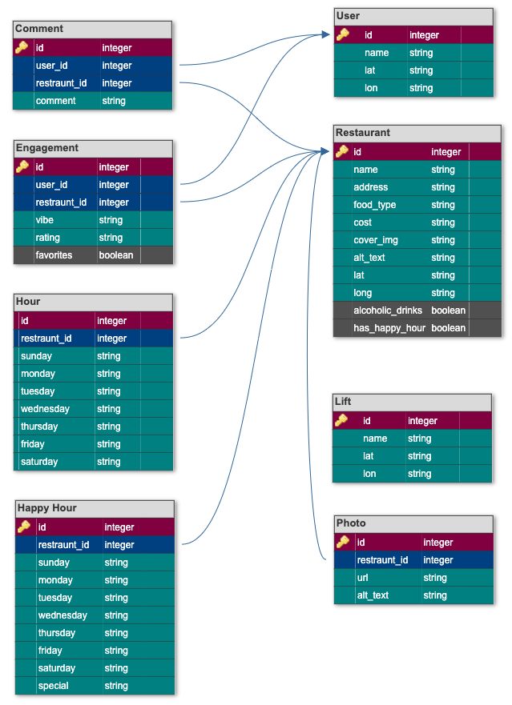

# README

<div align="center">

  [![Python package][test-shield]][test-url]
  [![Contributors][contributors-shield]][contributors-url]
  [![Forks][forks-shield]][forks-url]
  [![Issues][issues-shield]][issues-url]


<h3 align="center">

[Après-Ski App](https://github.com/Apres-Ski/Apres-Ski-FE/blob/main/src/assets/app-gif.gif)

<a href="https://github.com/Apres-Ski/Apres_Ski_BE/issues">Report Bug</a>
    ·
<a href="https://github.com/Apres-Ski/Apres_Ski_BE/issues">Request Feature</a>
</h3>
</div>
<br>

Hungry and tired after a day at Breckenridge? Looking to find somewhere that's fun, good vibes, and close enough to walk?

**Find it with Après-Ski!**

The web application geared towards snowsport entheusiests looking to find their post slopes *food & drinks* to round out a good day.
<br>

---
<h2>Table of Contents</h2>

> :skier: [Getting Started](#getting-started)
> <br>
> :skier: [API Endpoints](#api-endpoints)
> <br>
> :skier: [Project Overview](#project-overview)
> <br>
> :skier: [Collaborators](#collaborators)
> <br>
> :skier: [Contributing](#contributing)
> <br>
> :skier: [Acknowledgments](#acknowledgments)
> <br>


<!-- GETTING STARTED -->

## Getting Started

### Web Usage

This is a Django REST Framework API designed for a use with our [Front-End Team's](https://github.com/Apres-Ski/Apres-Ski-FE) React web application. To get started in the application, follow [this link](https://apres-ski-fe.vercel.app/) and select one of our test-users. Once you selected a user you will be able to:

- Browse a list of restaurants near you based on:
    - Vibe
    - Proximity to the user
- Select "Filter" to narrow down the list of restaurants based on:
    - Vibe
    - Alcohol
    - Happy Hour
- Select "Show Details" on a restaurant to see further information such as:
    - Address
    - Food Type
    - Alcohol
    - Cost
    - Hours
    - Happy Hour
- Select a restaurant marker on the map to automatically scroll to that restaurant

<br>

### Local Installation

This back-end application was made with the following:

* Python 3.11.1
* Django 4.1.6

To install and run on your personal computer you will need to do the following:

1. Get a free API Key for Geoapify's Routing-API at [Geoapify](https://www.geoapify.com/).
2. Fork and clone the repo to your local machine.
3. In the root directory of APRES_SKI_BE, create a file named `keys.py`.
4. Inside `keys.py` create a variable named `routing_key = 'your_key_as_string'`
    * Note: `keys.py` should be *grayed out*. If it is not, check the `.gitignore` and resolve the issue before pushing any changes.
5. Install requirements.
    ```zsh
    pip3 install -r requirements.txt
    ```
6. Migrate and seed database.
    ```zsh
    $ python3 manage.py migrate
    $ python3 manage.py loaddata user.json
    $ python3 manage.py loaddata restaurant.json
    $ python3 manage.py loaddata engagement.json
    $ python3 manage.py loaddata hour.json
    $ python3 manage.py loaddata happyhour.json
    $ python3 manage.py loaddata lift.json
    $ python3 manage.py loaddata comment.json
    $ python3 manage.py loaddata photo.json
    ```
7. Start a server.
    ```zsh
    python3 manage.py runserver
    ```
8. Navigate to <http://localhost:8000/api/v1/>

<br />

<!-- API ENDPOINTS -->

## API Endpoints
### GET

<details>
<summary> <code>localhost:8000/api/v1/restaurant</code> </summary>

>**Description**
> - Get a list of restaurants.
>
>**Parameters**
> - N/A
>
>**Response**
>#### 200 OK
>
> ```json
> {
>   "data": [
>     {
>       "type": "str",
>       "id": "int",
>       "attributes": {
>           "name": "str",
>           "address": "str",
>           "food_type": "str",
>           "cost": "str",
>           "cover_img": "str",
>           "alt_text": "str",
>           "lat": "str",
>           "lon": "str",
>           "alcoholic_drinks": "bool",
>           "has_happy_hour": "bool",
>           "hour": [
>             {
>               "id": "int",
>               "sunday": "str",
>               "monday": "str",
>               "tuesday": "str",
>               "wednesday": "str",
>               "thursday": "str",
>               "friday": "str",
>               "saturday": "str",
>               "restaurant": "int (id)"
>             }
>           ],
>           "happyhour": [
>             {
>               "id": "int",
>               "sunday": "str",
>               "monday": "str",
>               "tuesday": "str",
>               "wednesday": "str",
>               "thursday": "str",
>               "friday": "str",
>               "saturday": "str",
>               "special": "str",
>               "restaurant": "int (id)"
>             }
>           ],
>           "engagement": [
>             {
>               "id": "int",
>               "vibe": "str",
>               "rating": "str",
>               "favorites": "bool",
>               "restaurant": [
>                   "int"
>               ],
>               "user": [
>                   "int"
>               ]
>             },
>             {"..."}
>           ]
>         }
>      },
>      {"..."}
>    ]
> }
>```
>
>#### 404 Not Found
>
>```json
>{
> "errors": [
>  {
>   "detail": "Not found.",
>   "status": "404",
>   "code": "not_found"
>  }
> ]
>}
>```
>
>**Notes**
>
> * `hour`, `happyhour`, and `engagement` will return empty arrays if there is no associated table for the given restaurant.

</details>

<details>
 <summary><code>localhost:8000/api/v1/user</code></summary>

>**Description**
> * Get a list of users.
>
>**Parameters**
> * N/A
>
>**Response**
>#### 200 OK
>
> ```json
> {
>  "data": [
>	  	{
>			"type": "str",
>			"id": "int",
>			"attributes": {
>				"name": "str",
>				"lat": "str",
>				"lon": "str",
>           }
>     },
>     {"..."}
>	  ]
>}
>```
>
>#### 404 Not Found
>
>```json
>{
>	"errors": [
>		{
>			"detail": "Not found.",
>			"status": "404",
>			"code": "not_found"
>		}
>	]
>}
>```

</details>

<details>
 <summary><code>localhost:8000/api/v1/lift</code></summary>

>**Description**
> * Get a list of lifts.
>
>**Parameters**
> * N/A
>
>**Response**
>#### 200 OK
>
> ```json
>{
>	"data": [
>		{
>			"type": "str",
>			"id": "int",
>			"attributes": {
>				"name": "str",
>				"lat": "str",
>				"lon": "str",
>            }
>	    },
>	    {"..."}
>	  ]
>}
>```
>
>#### 404 Not Found

>```json
>{
>	"errors": [
>		{
>			"detail": "Not found.",
>			"status": "404",
>			"code": "not_found"
>		}
>	]
>}
>```

</details>

<br>

<!-- PROJECT OVERVIEW -->

## Project Overview

### Learning Goals
The Back-End Team's learning goals were:

- Gain exposure and experience to ***Python*** and ***Django REST Framework***.
- Implement Agile work process throughout development.
- Use Service Oriented Architecture concepts.
- Practice professional git workflow and pull request reviews.
- Implement Continuous integrations.
- Further hone communicational skills with a Front-End Team by doing daily stand-ups and slack networking.
<br>

### Planning

The first four days of our project was dedicated to planning. In this time our Front-End and Back-End Teams were assigned to a student created project pitch and began work:

* Day 1: Teams discussed any human factors and personnel limitations over the duration of the project, started work on a Minimal Viable Product Document, and created all infrastructure (GitHub: Organization, Repositories, Teams, & Projectboard).
* Day 2: Teams discussed any capabilities and limitations in their selected tech-stack and finalized selection of what data would be collected, stored, and consumed.
* Day 3: Teams completed the Minimal Viable Product Document
* Day 4: Back-End Team created a small-scale test database and API as a proof of concept for approval by the Front-End Team and finalized the JSON Contract Document.

<br>

### Tech Stack

Après-Ski's Back-end is a ***Django REST Framework*** API, built with ***Python*** & ***PostgreSQL***, and hosted on***Heroku***.

<br>
<div align='center'>
  
</div>

<br>

### Minimum Viable Product (MVP) and Extensions Roadmap

***MVP***

The Back-End Teams's MVP goals were to design, create, and deploy all requested endpoints for our Front-End Team to consume and display. For this we started with a ***PostgreSQL*** database and the following tables:

- User
- Restaurant
- HappyHour
- Hour
- Lift
- Engagement

Each table stored real data on various restaurants and lifts in Breckinridge Colorado. Information was gathered through various travel and restaurant websites and then turned into seed files, which we used to populate our database.

After our database was setup we created the above endpoints (see: [API Endpoints](#api-endpoints)), as requested by our Front-End Team, in accordance with the [json:api](https://jsonapi.org/) standard.

All MVP goals were met. Testing for our API is at 99% coverage.

***Extensions***

The Back-End Team's Extension goals were to:

- Create an external API call to Geoapify for /routing & /landmark endpoints.
  - This was completed for /routing. However it was decided that other extensions should be prioritized due to time constraints.
  - The /routing endpoint is not on our deployed site as it is not used by the Après-Ski webapp.
- Create two new tables: Photo & Comment

All extensions (except the /landmark endpoint) were completed and tested. Below is the final version of our database tables and relationships.

<br>
<div align='center'>
  
</div>
<br>

Future features we would like to implement for our API:

- Create another external API call to Geoapify to collect information on local landmarks.
- Use ***Django REST Framework's*** TokenAuthentication class to implement authentication for any CREATE, POST, or PATCH requests.

<br>

<!-- COLLABORATORS -->

## Collaborators

<div align='left'>
<table style='border: none'>
<tr>
<th>Joseph Hilby</th>
<th></th>
</tr>
<tr>
<td>
  

[![GitHub: josephhilby][joe-github-follow-badge]][joe-GitHub] <br>
[![LinkedIn: josephmhilby][linkedin-badge]][joe-LinkedIn]

</td>
<td>
<p>
My goal in this project was to step out of my comfort zone with Ruby on Rails and try out a new language and framework. While it made the project considerably harder, I really enjoyed digging through the docs of a new tech-stack and seeing just how quickly I could bring myself up-to-speed. <br><br>
I am extremely happy that we were able to get 99% testing coverage, on 8 tables, each with full CRUD functionality, in a new language & framework, all in two weeks.
</p>
</td>
</tr>
</table>
</div>

<div align='left'>
<table style='border: none'>
<tr>
<th>Kristen Nestler</th>
<th></th>
</tr>
<tr>
<td>


[![GitHub: knestler][kristen-github-follow-badge]][kristen-GitHub] <br>
[![LinkedIn: kristen-nestler][linkedin-badge]][kristen-LinkedIn]

</td>
<td>
<p>
When I pitched the idea for Après-Ski,  I was excited to combine my passions for skiing with my love for software engineering. I proposed using Python and Django for the backend, and Javascript and React for the front end so our team could gain more experience with learning new technologies. 

Après-Ski delivered on all fronts. It was a great experience working with a true full-stack team to bring this application to life.  I gained new strategies to quickly learn unfamiliar tech stacks and used a full SDLC to successfully build Après-Ski.
</p>
</td>
</tr>
</table>
</div>

<div align='left'>
<table style='border: none'>
<tr>
<th>Kevin Ta</th>
<th></th>
</tr>
<tr>
<td>


[![GitHub: KevinT001][kevin-github-follow-badge]][kevin-GitHub] <br>
[![LinkedIn: kevin-ta-b1a36723b][linkedin-badge]][kevin-LinkedIn]
</td>
<td>
<p>
Being apart of the Apres-Ski team, I had a personal goal of wanting to get first hand experience being a part of a Service Oriented Architecture application. This came with side goals of further developing proper communicational skills and collaboration with the Front-End team. During my course at Turing School of Software and Design, my experience was focused on Ruby and Ruby on Rails, so choosing to develop our Apres-Ski Application in Python was also an exposure to another language I further wish to continue exploring!
</p>
</td>
</tr>
</table>
</div>


<!-- CONTRIBUTING -->

## Contributing

Do you have a better & cooler way of doing what we did? Your contribution would be **greatly appreciated**.

Please fork the repo, create your branch, and create a pull request. You can also simply open an issue with the tag "enhancement".

1. Fork the Project
2. Create your Feature Branch (`git checkout -b feature/<AmazingFeature>`)
3. Commit your Changes (`git commit -m 'Add some AmazingFeature'`)
4. Push to the Branch (`git push origin feature/<AmazingFeature>`)
5. Open a Pull Request

Thanks again!

<!-- ACKNOWLEDGMENTS -->

## Acknowledgments

Special *thank you!*, for your insight and help, as we designed and built an API in a totally new language and framework:

* [Mike Hernandez](https://github.com/mikez321)
* [Jake Cohen]()

Thank you [Tricia Holmes](https://github.com/tricia-holmes) on our Front-End Team for your PR setting up CORS!

This project was the capstone for our team at:
* [Turing School of Software Design](https://turing.edu/)

<p align="right">(<a href="#README">back to top</a>)</p>


<!-- MARKDOWN LINKS & IMAGES -->

<!-- Tests Shield -->
  [test-shield]: https://github.com/Apres-Ski/Apres_Ski_BE/actions/workflows/blank.yml/badge.svg
  [test-url]: https://github.com/Apres-Ski/Apres_Ski_BE/actions/workflows/blank.yml

<!-- Contributors Shield -->

[contributors-shield]: https://img.shields.io/github/contributors/Apres-Ski/Apres_Ski_BE.svg
[contributors-url]: https://github.com/Apres-Ski/Apres_Ski_BE/graphs/contributors

<!-- Forks Shield -->

[forks-shield]: https://img.shields.io/github/forks/Apres-Ski/Apres_Ski_BE.svg
[forks-url]: https://github.com/othneildrew/Apres-Ski/Apres_Ski_BE/network/members

<!-- Issues Shield -->

[issues-shield]: https://img.shields.io/github/issues/Apres-Ski/Apres_Ski_BE.svg
[issues-url]: https://github.com/Apres-Ski/Apres_Ski_BE/issues

<!-- LinkedIn Badges -->

[linkedin-badge]: https://img.shields.io/badge/LinkedIn-%23?style=flat&logo=Linkedin&logoColor=black&color=0A66C2

[joe-LinkedIn]: https://www.linkedin.com/in/josephmhilby/
[kristen-LinkedIn]: https://www.linkedin.com/in/kristen-nestler/
[kevin-LinkedIn]: https://www.linkedin.com/in/kevin-ta-b1a36723b/

<!-- GitHub Badges -->

[joe-github-follow-badge]: https://img.shields.io/github/followers/josephhilby?label=GitHub&style=social
[joe-GitHub]: https://github.com/josephhilby

[kristen-github-follow-badge]: https://img.shields.io/github/followers/knestler?label=GitHub&style=social
[kristen-GitHub]: https://github.com/knestler

[kevin-github-follow-badge]: https://img.shields.io/github/followers/KevinT001?label=GitHub&style=social
[kevin-GitHub]: https://github.com/KevinT001
